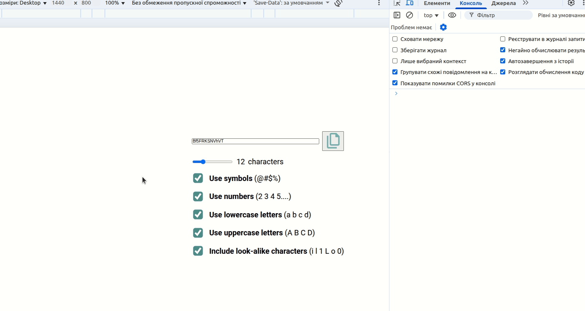

# Client-Side PRNG Password Generator (Vanilla JS + Clipboard API)

A lightweight, client-side password generator with live length control, toggleable character sets, and one-click copy to clipboard.

## Overview
**Smart Password Generator** is a simple web app that generates random passwords based on user-selected options (symbols, numbers, lowercase, uppercase, and visually similar characters). Everything runs in the browser with no dependencies, making it easy to try and safe to use offline.

## Features
- **Adjustable length**: Range slider (6–32) with live value preview.
- **Character set toggles**: Include/exclude symbols (`@#$%`), numbers, lowercase, uppercase, and **similar-looking characters** (`i l 1 L o 0`).
- **One-click copy**: Copies the current password to the clipboard via the Clipboard API; the copy button      gives visual feedback.
- **Instant updates**: Any change in options regenerates a password immediately.
- **Custom checkboxes**: Replaced default checkboxes with SVG-based visuals for a cleaner UI.
- **No build step / No libs**: Pure HTML, CSS, and Vanilla JS.

## Tech Stack
- **HTML5** for structure.
- **CSS3** for layout and custom checkbox styling (Google Fonts: Roboto).
- **Vanilla JavaScript** for DOM interactions, state handling, random generation, and clipboard support.
- **Clipboard API** for copy functionality.

## Getting Started
1. Clone or download this repository.
2. Open `index.html` in any modern browser.
3. Use the slider and checkboxes to configure your password.
4. Click the copy button to copy the generated password.

## How It Works
- **Character pools** are defined for:
  - Symbols: `@ # $ %`
  - Numbers: `2–9` (with `0` and `1` considered “similar”)
  - Lowercase letters: `a–z` (excluding visually similar `i`, `l`, `o`)
  - Uppercase letters: `A–Z` (derived from lowercase and also excluding `I`, `L`, `O`)
- When options change, the app:
  1. Aggregates the **available characters** based on toggles.
  2. Optionally appends “similar” characters if enabled.
  3. Builds a password by picking random characters until the selected length is reached.
- **Clipboard**: Clicking the copy button writes the password to the clipboard and briefly toggles a `.copied` class for visual feedback.

## JavaScript Concepts I Practiced
- **DOM selection & events**: Using `getElementById`, `querySelector`, `querySelectorAll`, and attaching `input`/`click` listeners to update UI in real time.
- **State via form controls**: Reading checkbox/slider values to drive generation logic.
- **Array operations**: Creating and transforming character sets with `Array.from`, `map`, `filter`, and the **spread operator** for merging pools.
- **Character code handling**: Generating `a–z` via `String.fromCharCode` and then mapping to uppercase.
- **Randomization**: Selecting items using `Math.random()` and `Math.floor()` for uniform distribution over the built pool.
- **Clipboard API**: Implementing reliable **copy-to-clipboard** UX with a transient visual state (adding and removing a CSS class with `setTimeout`).
- **Progressive enhancement**: Replacing default form controls (checkboxes) with custom SVG visuals while preserving usability.

## Project Structure

├── index.html      # Markup: UI layout (password field, slider, checkboxes, copy button), script/style links
├── styles.css      # Styles: layout, typography (Roboto), custom checkbox visuals, copy feedback states
├── app.js          # Logic: character pools, options aggregation, password generation, events, Clipboard API handling
├── demo/           # Demos, recordings, and screenshots
│   └── demo.gif    # Animated demo used in README
└── images/         # Static assets used in the UI
    ├── copy.svg                # Copy-to-clipboard icon referenced from HTML/CSS
    ├── checkbox--unchecked.svg # Custom checkbox (unchecked state)
    └── checkbox--checked.svg   # Custom checkbox (checked state)

## Demo

